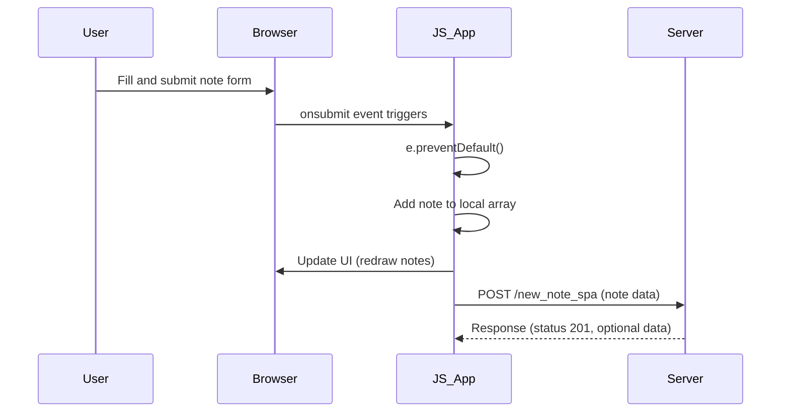

```mermaid
sequenceDiagram
    participant User
    participant Browser
    participant JS_App
    participant Server

    User->>Browser: Fill and submit note form
    Browser->>JS_App: onsubmit event triggers
    JS_App->>JS_App: e.preventDefault()
    JS_App->>JS_App: Add note to local array
    JS_App->>Browser: Update UI (redraw notes)
    JS_App->>Server: POST /new_note_spa (note data)
    Server-->>JS_App: Response (status 201, optional data)
```
