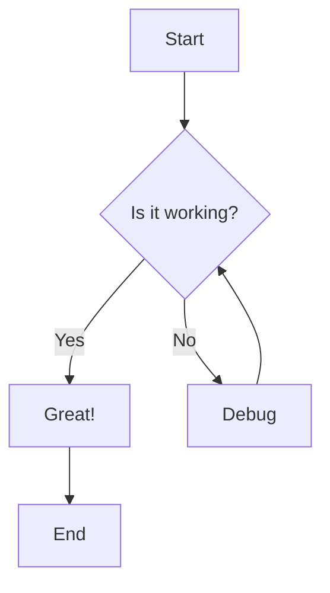
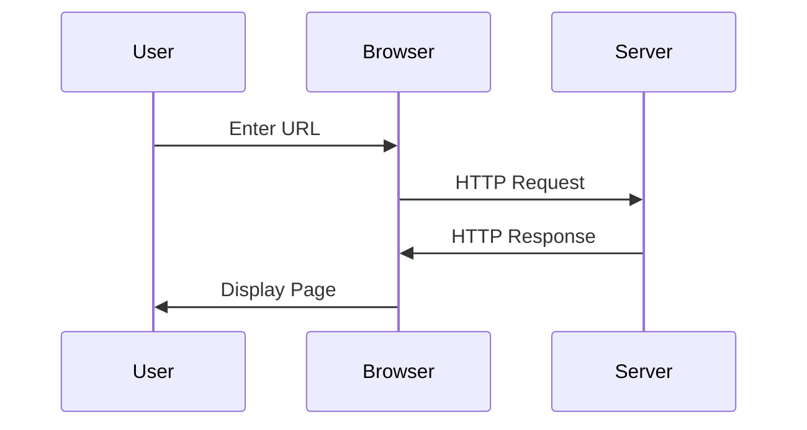
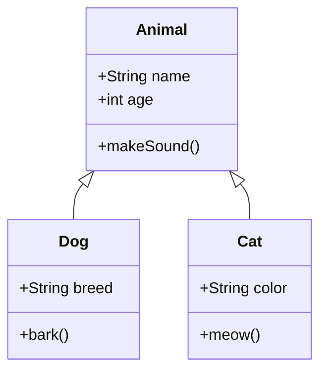

# Mermaid Diagram Examples

This file demonstrates Mermaid diagram rendering in Markdown.

## Flowchart Example

```mermaid
flowchart TD
    A[Start] --> B{Is it working?}
    B -->|Yes| C[Great!]
    B -->|No| D[Debug]
    D --> B
    C --> E[End]
```

## Sequence Diagram Example

```mermaid
sequenceDiagram
    participant User
    participant Browser
    participant Server
    User->>Browser: Enter URL
    Browser->>Server: HTTP Request
    Server->>Browser: HTTP Response
    Browser->>User: Display Page
```

## Class Diagram Example

```mermaid
classDiagram
    Animal <|-- Dog
    Animal <|-- Cat
    Animal : +String name
    Animal : +int age
    Animal : +makeSound()
    class Dog{
        +String breed
        +bark()
    }
    class Cat{
        +String color
        +meow()
    }
```
