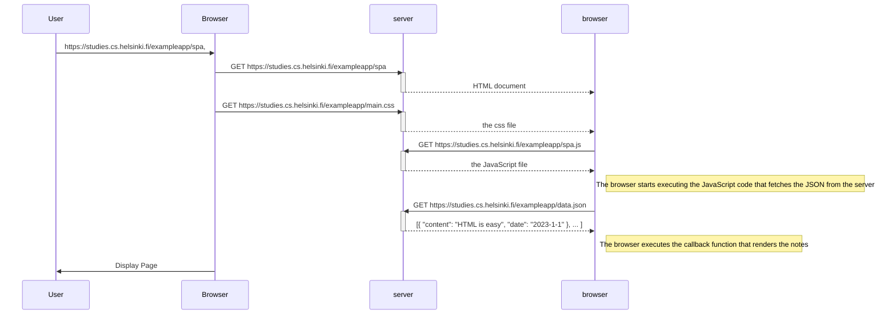

# Mermaid Diagram Examples

This file demonstrates Mermaid diagram rendering in Markdown showing the sequence diagram when user sends a request in a Single Page Application. FYI, The Mermaid can also be used for flow chart and class diagrams.

## Sequence Diagram Example

